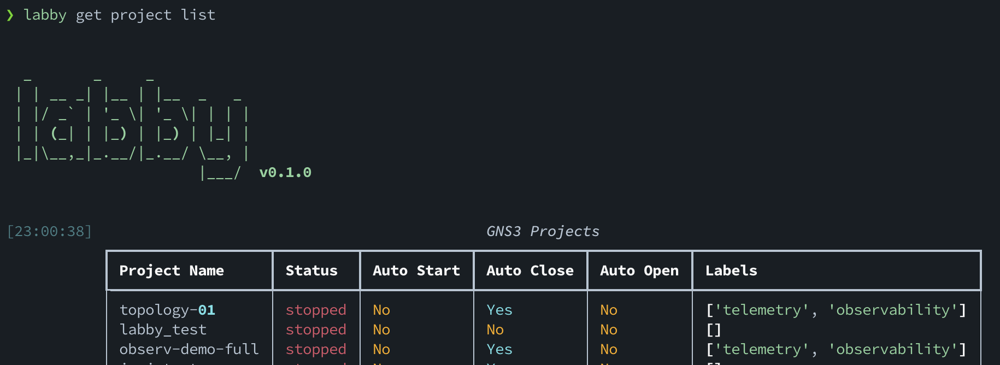
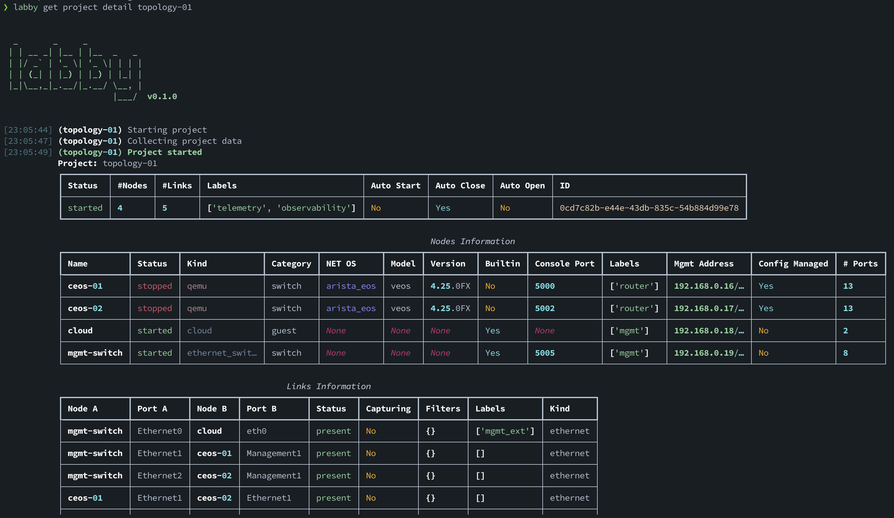
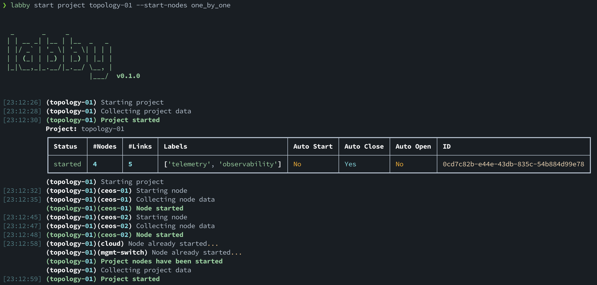
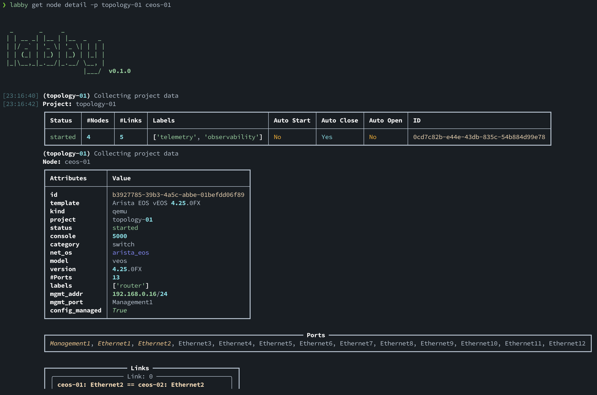
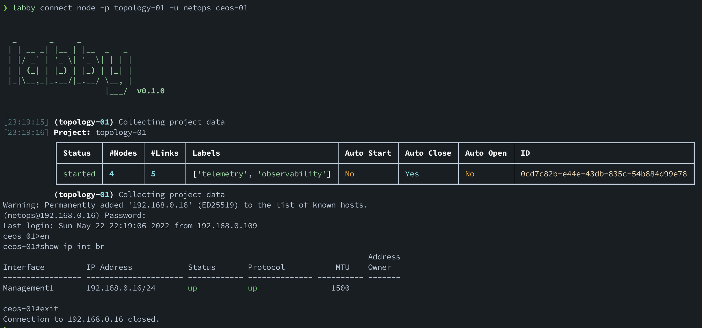

# Labby

[](https://github.com/ambv/black)
<!-- [](https://codecov.io/gh/davidban77/labby) -->
<!-- [](https://lgtm.com/projects/g/davidban77/labby/alerts/) -->
<!-- [](https://lgtm.com/projects/g/davidban77/labby/context:python) -->
[](https://pypi.python.org/pypi/labby)
[](https://github.com/davidban77/labby)
[](https://github.com/davidban77/labby/actions/workflows/tests.yml)
[](https://github.com/davidban77/labby/actions/workflows/docker_build.yml)


CLI Tool for interacting with Network Simulation systems to build and interact with Network Labs in an automated way.

## 1. Documentation

> **Note**
> Under Construction...∏

- [Labby](#labby)
  - [1. Documentation](#1-documentation)
  - [2. Install](#2-install)
    - [2.1 Developer version](#21-developer-version)
    - [2.2 Using labby docker container](#22-using-labby-docker-container)
  - [3. Requirements](#3-requirements)
  - [4. How it works](#4-how-it-works)
    - [4.1 Labby Configuration file](#41-labby-configuration-file)
    - [4.2 Environments and Providers](#42-environments-and-providers)
    - [4.3 Projects, Nodes, Templates and Links](#43-projects-nodes-templates-and-links)
    - [4.4 Labby state file](#44-labby-state-file)
  - [5. Extra Links](#5-extra-links)

## 2. Install

It is as simple as

```shell
pip install labby
```

### 2.1 Developer version

You will need to use `poetry` to handle installation and dependencies.

```shell
# Clone the repository
git clone https://github.com/davidban77/labby.git
cd labby

# Start poetry shell and install the dependencies
poetry shell
poetry install
```

### 2.2 Using labby docker container

Labby is also packaged under a container, `davidban77/labby`, based on python-slim image.

```shell
 > docker run -v $HOME/.config/labby/labby.toml:/opt/labby/labby.toml \
             -v $HOME/.config/labby/.labby.json:/opt/labby/.labby.json \
             -i -t \
             davidban77/labby:v0.1.0-py3.8 bash
```

It is particularly useful if you don't want to setup a virtual environment to install all the dependencies.

---

## 3. Requirements

Besides having the `labby` tool installed, you will need:

- A [**provider**](#51-environments-and-providers). For now the only supported is GNS3.
- A [**labby configuration file**](#51-labby-configuration-file). Sets the necessary settings for connecting to a provider.
- `telnet` (for console connection) and/or `ssh` installed. So labby can perform some ad-hoc connections actions if needed.

## 4. How it works

Once you have the configuration file setup, and `labby` installed on your system then you are good to go!.

The CLI tool serves multiple purposes, for example it is a way great to discover the projects or network topologies avaiable on the Network Virtualization system, start or stop the nodes, push configuration, etc...

For examplem to show the available projects and their status in GNS3:



Now, let's get the details of the network lab `topology-01`:



It is a small topology with 2 Arista `ceos` devices connected between each other, and also connected to a `cloud` and `mgmt` switch to allow them to be reachable to the outside world.

The **Mgmt Address** shows the IP address information for their management interfaces. The setup and configuration of those are explained in the *Docs*.

You can start the nodes of the entire project one by one, for example:



Devices are up and you can check their status and more details:



You can connect to the nodes via SSH (if IP address for management is set and is reachable), or you can connect over console if available. For example:



And like this there are many more features...

### 4.1 Labby Configuration file

For labby to work, you need a configuration file (`labby.toml`) that specifies the [**providers**](#environments-and-providers) you have at your disposal to connect.

By default `labby` will search for the configuration file at the current directory, if not found it will search at the labby configuration space of the user's home directory (`$HOME/.config/labby/labby.toml`)

Here is an example configuration file:

```toml
[main]
environment = "default"

[environment.default]
provider = "home-gns3"
description = "Home lab environment"

    [environment.default.providers.home-gns3]
    server_url = "http://gns3-server:80"
    verify_cert = "false"
    kind = "gns3"
```

`labby` introduces **providers** which should be seen as the Network Simulation system (a GNS3 server for example), and **environments** which should be seen as the environment where that network simulation is hosted.

The idea behind this structure is to provide flexibility to use multiple providers and labs in different environments (home lab and/or cloud based).

### 4.2 Environments and Providers

`labby` relies on *`providers`* to interact, create and destroy with the Network Topologies. The provider supported so far is **GNS3** by the use of [`gns3fy`](https://github.com/davidban77/gns3fy).

A *provider* is just a representation of a Network Simulation systems, like a GNS3 server for example.

An *environment* serves as a construct that holds attributes and multiple *providers*.

### 4.3 Projects, Nodes, Templates and Links

Each **provider** provides **projects** which should be seen as network labs. These projects is where you can create **nodes** based from **templates**, and create **links** to finally build a network topology.

Using the GNS3 provider as an example:

- A `labby project` is a network topology in GNS3. It needs to start in order to access it.
- A `labby node` is a network object. This can be a router, switch, container, among others in GNS3.
- A `labby template` is the base settings to be able to **create a node**. Is where the main information of the **node** is inherited.
- A `labby link` is a network link in GNS3. It provides a way to connect between 2 nodes and can provide functionality like packet loss or jitter on the link.

Labby is CLI tool to interact with all these entities.

### 4.4 Labby state file

`labby` relies havily on the state of the current **provider** to get information about the objects that interacts with.

Now, labby augments these objects by providing extra attributes and storing them at a central location (`$HOME/.config/labby/.labby.json`).

These are:

- `labels` which is of an array type, and these can be added at the moment of creation or update.
- `mgmt_port` Management interface of the **node**, useful for generating bootstrap configuration for the node.
- `mgmt_ip` Management IP Address of the **node**, useful for generating bootstrap configuration and also connecting to the node.

The attributes are generally added at the time of the object creation, but they can also be added at a later stage if needed (this is normally done with `labby update` command).

## 5. Extra Links

- [Node Configuration Management](docs/NODE_CONFIGURATION.md)
